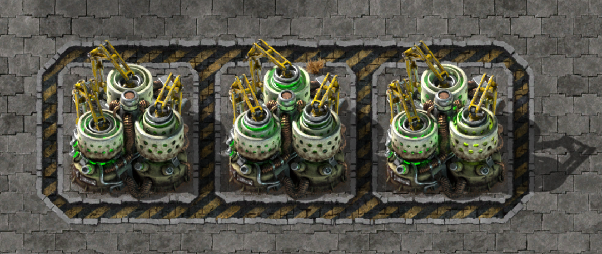

# Tintable Centrifuges

[Github](https://github.com/gamma-delta/tintable-centrifuges) | [Mod portal](https://mods.factorio.com/mod/tintable-centrifuges)

Makes each spinner of the centrifuge individually colorable.

## For Mod Developers

Just add a `crafting_machine_tint` to your centrifuge recipes.

- `primary` is the left spinner.
- `secondary` is the right spinner.
- `tertiary` is the center spinner.
- `quaternary` is the light color.

Even if the user doesn't use this mod in the end, adding `crafting_machine_tint` won't break anything in vanilla (although of course nothing will happen).

Any recipe that doesn't define a color falls back to the default neon-green.
